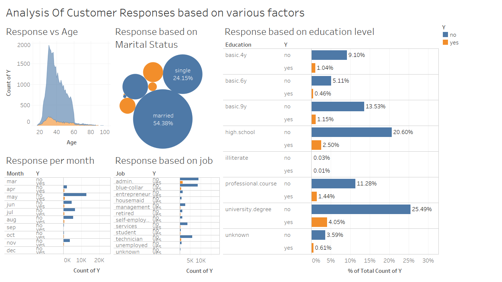

<p align="center">
  <a href="" rel="noopener">
 </a>
</p>

<h3 align="center">Classification of Customers from Bank Data</h3>

<div align="center">

[]()
[](https://github.com/kylelobo/The-Documentation-Compendium/issues)
[](https://github.com/kylelobo/The-Documentation-Compendium/pulls)
[](/LICENSE)

</div>

---

<p align="center"> Using data from a Portugesse bank,our task is to classify which customers of the bank are likely to subscribe to a term deposit or not. Here we employ various machine learning algorithm so as to classify the customers. We explore the data using Tableau and preprocess it using various python libraries before creating our machine learning models.
    <br> 
</p>

## 📝 Table of Contents

- [About](#about)
- [Getting Started](#getting_started)
- [Acknowledgments](#acknowledgement)

## 🧐 About <a name = "about"></a>
Classification of these customers will help the marketing team to appropriately allocate marketing/advertising resources to try and convert potentioal customers to actual subscribers.This will ensure that the bank is able to turn potential customers into actual customers without using resources on customers who are likely not to subscribe.

## 🏁 Getting Started <a name = "getting_started"></a>

These instructions will get you a copy of the project up and running on your local machine for development.

### Prerequisites

All the requirements needed to run this project are in the "requirements.txt" file


### Installing

A step by step series of examples that tell you how to get a development env running.

This steps creates a conda enviroment called "bank_project"(feel free to use a different enviroment name) in your computer

```
conda create env -n "bank_project"
```

Install the prerequistes in the enviroment you just created

```
pip install -r requirements.txt
```


## 🎉 Acknowledgements <a name = "acknowledgement"></a>

- Inspiration
Thanks to 10Academy

- References
